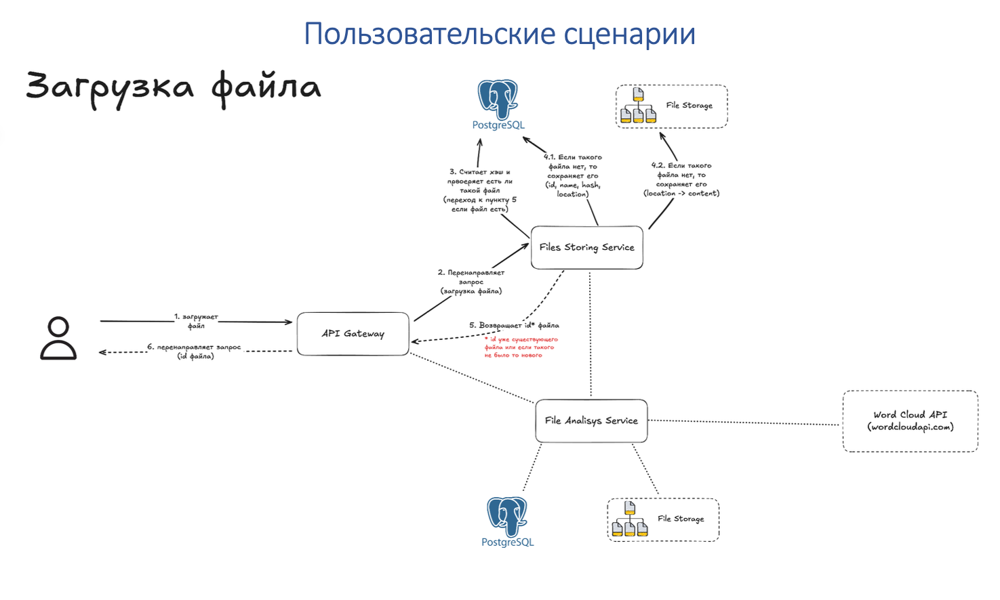
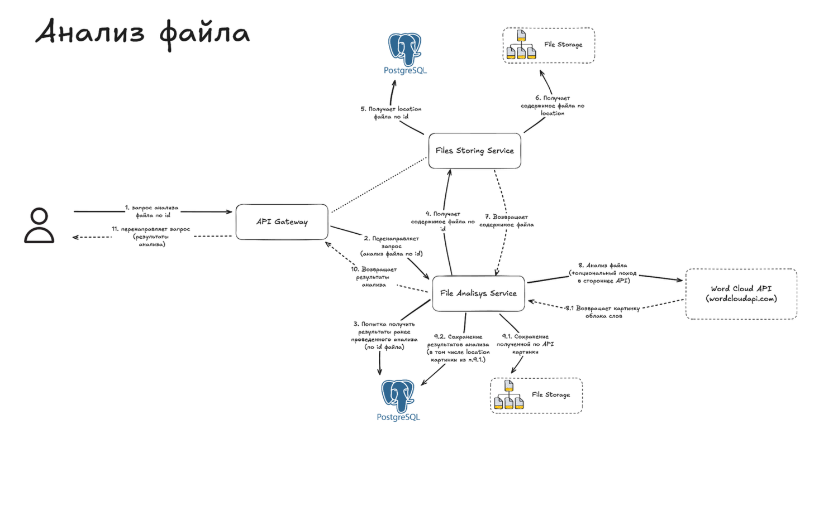
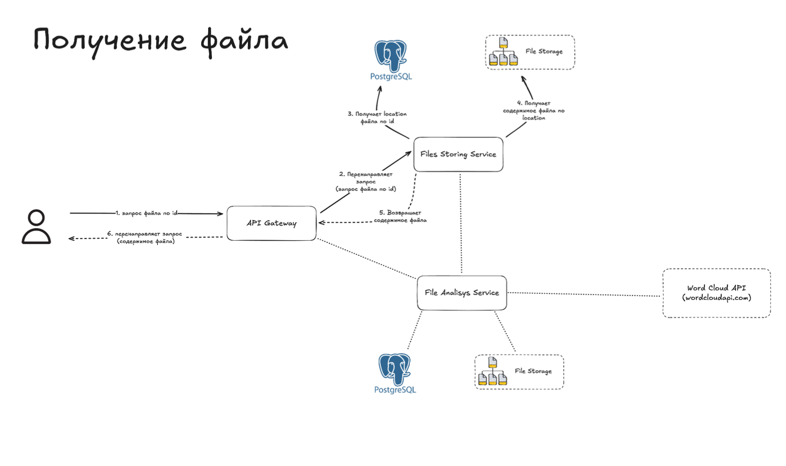
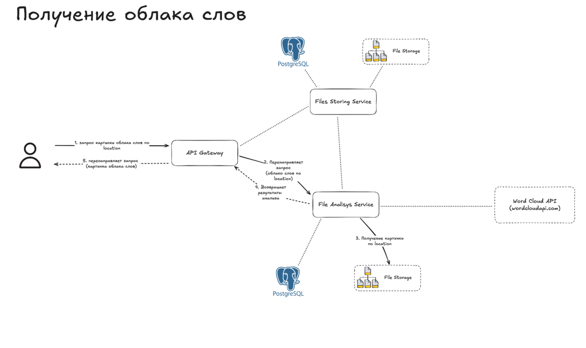
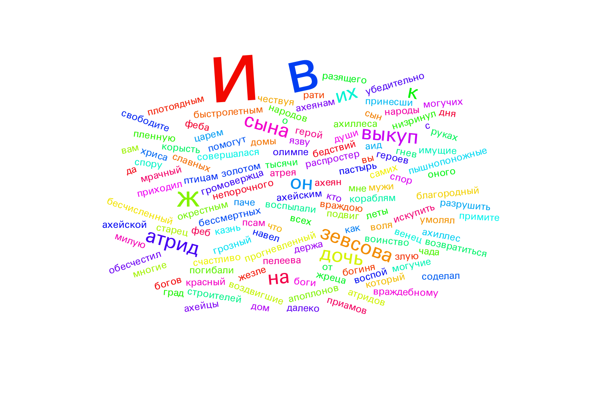
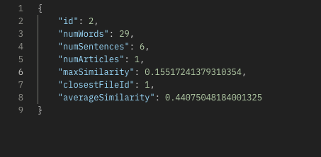

# Микросервисное приложение для хранения файлов и их проверки на плагиат

#### Ссылка на swagger-документацию lля тестирования: http://localhost:8081/swagger-ui/index.html#/

## Принцип работы и пользовательские сценарии

#### Приложение разделено на три микросервиса: ApiGateway - отвечает за взаимодействие с пользователем, использует протокол http; FilesService - отвечает за создание, хранение файлов и проверку их на полную идентичность (расчет хеша), StatService - отвечает за подсчет статистики по тексту, подсчет схожести текстов, получение и хранение карт слов.
#### Для взаимодействия между микросервиса используется gRPC, для отправки запросов на стороннее api используется http.
#### Каждый микросервис реализован с соблюдением принципов чистой архитектуры.
#### Принцип работы и пользовательские сценарии полностью реализуют схему ниже: 






#### Кроме того, реализован простой подсчет близости текстов на основе частот встречи слов в текстах и косинусного расстояния между векторами. Для этого в file_service и stat_service реализован scheduled-метод getAllFiles, который получает все находящиеся на данный момент в хранилище файлы. Вызывать его при каждом подсчете статистики слишком дорого, он сделан scheduled, время между вызовами можно настраивать (пока только хардкодить). При подсчете статистики считается косинусное расстояние между текущим файлом и остальными, в качестве ответа выводится id наиболее похожего файла и расстояние до него, а также среднее расстояние до файлов, которые ближе некоторого порога к данному файлу (порог тоже пока только хардкодить). 

### Для двух равных файлов расстояние будет равно 0. Для двух абсолютно различных с точки зрения этой метрики файлов значение будет равно 1.

#### Пример карты слов для одного из текстовых файлов из примеров:



#### Пример статистики для одного из текстов из примеров: 



#### Ближайшее расстояние получено для текстов: 

```text
Мне не грозит опасность, Скайлер, я и есть опасность! Кто-то откроет дверь и схватит пулю. Думаешь, им буду я?! Нет. Это я постучу в дверь. Я и есть опасность.
```

```text
Мне не грозит безопасность, Скайлер, я и есть безопасность! Кто-то откроет дверь и схватит пулю. Думаешь, им буду я?! Нет. Это я постучу в дверь. Я и есть безопасность.
```

#### Как видим, эти тексты очень похожи, что и отражается малым значением метрики для них.